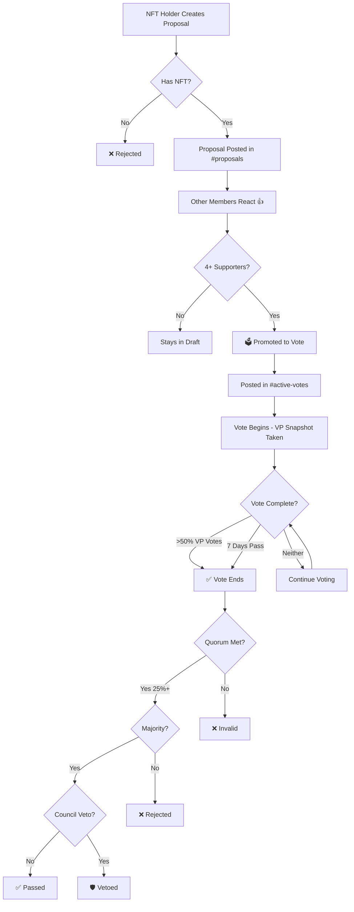
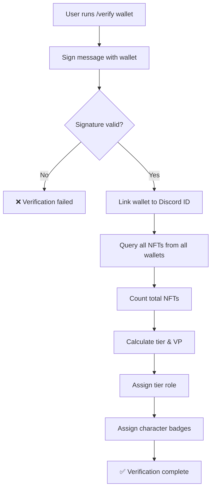
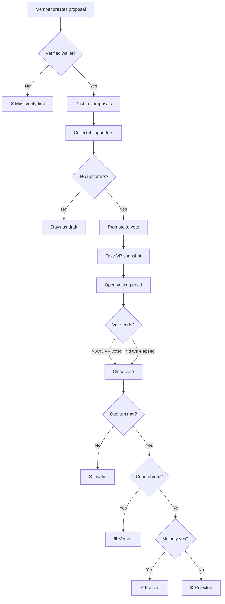
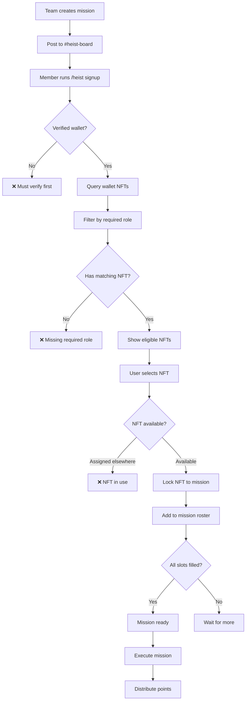

# Discord Bot Integration Architecture

## Overview
Two Discord bots will power the core gamified experience: **The Commission Bot** (DAO governance) and **The Heist Bot** (mission system).

---

## 1. The Commission Bot (DAO Governance)

### Core Workflow



### Technical Requirements

#### NFT Verification
- **On-chain snapshot**: Query Solana blockchain for wallet addresses holding SOLPRANOS NFTs
- **Wallet linking**: Members must verify wallet ownership via Discord OAuth or message signing
- **VP calculation**: Count NFTs per wallet → assign tier → calculate voting power
- **Real-time sync**: Update member roles when NFTs are transferred

#### Discord Role Management
The bot manages two separate role systems:

**1. Tier Roles (Quantity-Based) - For Voting Power:**
```
🔱 Don Holder        (150+ NFTs) - 18 votes
👔 Underboss Holder  (50-149 NFTs) - 14 votes
⭐ Elite             (15-49 NFTs) - 10 votes
🎖️ Capo             (7-14 NFTs) - 6 votes
⚔️ Soldato          (3-6 NFTs) - 3 votes
🤝 Associate         (1-2 NFTs) - 1 vote
```
*These roles determine Discord permissions and voting power.*

**2. Character Role Badges (Trait-Based) - For Mission Eligibility:**
Smaller badge roles showing which character traits a user owns:
```
🔫 The Hitman      (owns NFT with "Role: The Hitman" trait)
💼 The Accountant  (owns NFT with "Role: The Accountant" trait)
🚗 The Driver      (owns NFT with "Role: The Driver" trait)
👊 The Enforcer    (owns NFT with "Role: The Enforcer" trait)
```
*These badges are purely cosmetic and show diversity of owned characters.*
*Mission signup checks the actual NFT metadata, not these badges.*

**Auto-Role Commands:**
- `/verify <wallet>` - Link wallet and receive role
- `/refresh-roles` - Manually trigger role update
- `/check-role @user` - View someone's tier

**Admin Commands:**
- `/admin-wallet @user` - View linked wallet address (Team only)
- `/admin-wallets` - Export all user-wallet mappings (Team only)
- `/admin-force-verify @user <wallet>` - Manually link wallet (Team only)
- `/admin-unlink @user` - Remove wallet verification (Team only)

**Role Update Logic:**
```javascript
async function updateUserRole(userId) {
  const wallet = await getLinkedWallet(userId);
  const nftCount = await countNFTs(wallet);
  
  // Determine tier
  const tier = calculateTier(nftCount);
  
  // Remove old tier roles
  await removeAllTierRoles(userId);
  
  // Assign new role
  if (tier) {
    await assignRole(userId, tier.discordRoleId);
  }
  
  // Log change
  logRoleChange(userId, oldTier, tier);
}
```

**Automatic Role Sync:**
- **Periodic scan**: Every 6 hours, check all linked wallets for NFT changes
- **Transfer detection**: Listen to on-chain events for NFT transfers
- **Manual trigger**: Users can request immediate refresh
- **Grace period**: 24-hour buffer before downgrading (prevents gaming during transfers)

**Role Permissions:**
- **Channel access**: Higher tiers unlock exclusive channels (#don-lounge, #council-chamber)
- **Voting weight**: Role visually indicates VP (18 votes vs 1 vote)
- **Mission access**: Some heists require minimum tier


#### Proposal System
- **Commands**:
  - `/propose <title> <description>` - Create new proposal
  - `/support <proposal-id>` - Support a draft proposal
  - `/vote <proposal-id> <yes/no/abstain>` - Cast vote

- **Data Storage**:
  ```json
  {
    "proposalId": "P-001",
    "creator": "user_discord_id",
    "creatorWallet": "sol_address",
    "title": "Season 2 Theme",
    "description": "...",
    "status": "draft|voting|passed|rejected|vetoed",
    "supporters": ["user_id1", "user_id2", "user_id3", "user_id4"],
    "votes": {
      "yes": { "vp": 420, "voters": [...] },
      "no": { "vp": 89, "voters": [...] },
      "abstain": { "vp": 50, "voters": [...] }
    },
    "vpSnapshot": { "total": 5555, "eligible": 4200 },
    "startTime": "2025-01-01T00:00:00Z",
    "endTime": "2025-01-08T00:00:00Z",
    "quorumReached": true,
    "councilVeto": false
  }
  ```

#### Voting Mechanics
- **VP Snapshot**: Taken at vote start, locked for duration
- **Vote tracking**: One vote per Discord account (multi-wallet holders use highest VP)
- **Auto-close triggers**:
  1. >50% of total VP has voted
  2. 7 days elapsed
- **Quorum check**: 25% of total VP must participate
- **Council veto**: Team + Don Holders can unanimously veto

#### Website Integration
- **API Endpoint**: `/api/votes/active` returns current votes
- **Real-time updates**: WebSocket or polling for live vote counts
- **Display on DAO page**: Replace mock proposal cards with real data

---

## 2. The Heist Bot (Mission System)

### Core Workflow

```mermaid
flowchart TD
    A[Mission Created by Team] --> B[Posted in #heist-board]
    B --> C[Shows Required Roles]
    C --> D[NFT Holder Views Mission]
    D --> E{Has Required Role?}
    E -->|No| F[❌ Can't Sign Up]
    E -->|Yes| G[/signup clicked]
    G --> H[Verify NFT Ownership]
    H --> I{Role Matches?}
    I -->|No| J[❌ Missing Role]
    I -->|Yes| K[✅ Signed Up]
    K --> L[Added to Mission Roster]
    L --> M[Mission Executes]
    M --> N[Rewards Distributed]
```

### Technical Requirements

#### Role-Based Access
**Character Role Verification Flow:**

When a user tries to join a mission requiring "The Enforcer":

1. **Check Wallet**: Query user's linked wallet for all SOLPRANOS NFTs
2. **Read Metadata**: For each NFT, read the `Role` trait from on-chain metadata
3. **Filter Eligible**: Show only NFTs with matching role trait
4. **Interactive Selection**: User chooses which specific NFT to assign
5. **Lock NFT**: Mark NFT as assigned (can't use for other missions)

```javascript
async function getEligibleNFTs(userId, requiredRole) {
  const wallet = await getLinkedWallet(userId);
  const allNFTs = await getAllNFTs(wallet);
  
  const eligible = [];
  for (const nft of allNFTs) {
    // Read on-chain metadata
    const metadata = await getMetadata(nft.mint);
    const roleAttribute = metadata.attributes.find(a => a.trait_type === "Role");
    
    // Check if role matches and NFT isn't already assigned
    if (roleAttribute?.value === requiredRole && !nft.assignedToMission) {
      eligible.push({
        mint: nft.mint,
        name: metadata.name,
        image: metadata.image,
        role: roleAttribute.value
      });
    }
  }
  
  return eligible;
}
```

**Example Signup Interaction:**
```
User: /heist signup M-042

Bot: This mission requires: The Enforcer
     You own 3 NFTs with this role:
     
     [1] SOLPRANOS #1234 - The Enforcer
     [2] SOLPRANOS #5678 - The Enforcer  
     [3] SOLPRANOS #9012 - The Enforcer (⚠️ Already assigned to Mission M-038)
     
     Which NFT do you want to assign? (Reply 1-2)

User: 1

Bot: ✅ SOLPRANOS #1234 assigned to Mission M-042!
     You're now signed up for "Treasury Heist: DEX Liquidity Raid"
```

#### Mission Structure
```json
{
  "missionId": "M-042",
  "title": "Treasury Heist: DEX Liquidity Raid",
  "description": "Extract liquidity from competitor protocol",
  "requirements": {
    "roles": [
      { "role": "The Hitman", "quantity": 1 },
      { "role": "The Enforcer", "quantity": 3 },
      { "role": "The Driver", "quantity": 1 }
    ],
    "minTier": "SOLDATO",
    "totalSlots": 5
  },
  "participants": [
    { 
      "userId": "123", 
      "wallet": "abc...", 
      "assignedNFT": {
        "mint": "FwE4x...",
        "name": "SOLPRANOS #1234",
        "role": "The Hitman"
      },
      "filledSlot": "The Hitman" 
    },
    { 
      "userId": "456", 
      "wallet": "def...", 
      "assignedNFT": {
        "mint": "Gh3K...",
        "name": "SOLPRANOS #5678",
        "role": "The Enforcer"
      },
      "filledSlot": "The Enforcer" 
    }
  ],
  "slots": {
    "The Hitman": { "required": 1, "filled": 1 },
    "The Enforcer": { "required": 3, "filled": 2 },
    "The Driver": { "required": 1, "filled": 0 }
  },
  "rewards": {
    "baseReward": 500,
    "currency": "SOL",
    "distribution": "equal",
    "bonusRoles": {
      "The Hitman": 1.5
    }
  },
  "status": "recruiting|ready|active|completed",
  "startTime": "2025-01-15T12:00:00Z"
}
```

**Multi-Role Example:**
```
🎯 Mission: Coordinated Exchange Raid
Slots: [████░] 4/5 filled

Required:
  ✅ 1x The Hitman (filled)
  ⚠️ 3x The Enforcer (2/3 filled) ← NEED 1 MORE!
  ❌ 1x The Driver (0/1 filled)

Reward: 100 SOL split equally
Bonus: The Hitman gets 1.5x share
```

**Secondary Market Impact:**
This system creates organic demand for specific NFT roles:
- High-value missions requiring "The Enforcer" → People buy Enforcer NFTs
- Multiple slots needed → Drives volume on secondary markets
- Rare roles (The Don, The Consigliere) → Premium pricing for exclusive missions
- Strategic collecting: Users may hold diverse roles to access more opportunities

#### Commands
- `/heist view` - Show available missions
- `/heist signup <mission-id>` - Join a mission
- `/heist status` - View your active missions
- `/heist history` - Past mission rewards

#### CO-OP Mode (Phase 2)
- **Team Formation**: Users can form teams with complementary roles
- **Example**: User A (The Driver) + User B (The Hitman) = Can complete missions requiring both
- **Reward Split**: Distributed among team members
- **Team Commands**:
  - `/team create <name>`
  - `/team invite <user>`
  - `/team signup <mission-id>`

---

## 3. Bot Architecture Decision

### **Recommendation: Single Unified Bot with 3 Distinct Processes**

Build **ONE bot** called "SOLPRANOS Bot" containing **three independent processes**:

```
┌─────────────────────────────────────────────────────┐
│              SOLPRANOS Discord Bot                  │
├─────────────────────────────────────────────────────┤
│                                                     │
│  ┌───────────────────────────────────────────┐    │
│  │  PROCESS 1: VERIFICATION & ROLE SYSTEM    │    │
│  │  - Wallet linking                         │    │
│  │  - NFT ownership verification             │    │
│  │  - Tier role assignment (quantity-based)  │    │
│  │  - Character badge assignment (trait)     │    │
│  │  - Periodic sync (every 6 hours)          │    │
│  └───────────────────────────────────────────┘    │
│                                                     │
│  ┌───────────────────────────────────────────┐    │
│  │  PROCESS 2: THE COMMISSION (DAO)          │    │
│  │  - Proposal creation & support            │    │
│  │  - VP snapshot & weighted voting          │    │
│  │  - Quorum checking                        │    │
│  │  - Council veto workflow                  │    │
│  │  - Auto-close triggers                    │    │
│  └───────────────────────────────────────────┘    │
│                                                     │
│  ┌───────────────────────────────────────────┐    │
│  │  PROCESS 3: THE HEIST (MISSIONS)          │    │
│  │  - Mission creation (team)                │    │
│  │  - Role-based eligibility check           │    │
│  │  - NFT selection & assignment             │    │
│  │  - Mission execution tracking             │    │
│  │  - Points distribution                    │    │
│  └───────────────────────────────────────────┘    │
│                                                     │
└─────────────────────────────────────────────────────┘
```

**Why One Bot:**
- ✅ **Shared data**: Process 2 & 3 depend on Process 1's verification
- ✅ **Consistent UX**: Users interact with one bot for all features
- ✅ **Easier maintenance**: Single codebase, one deployment
- ✅ **Lower cost**: One hosting instance, shared database pool

---

### **Process 1: Verification & Role System**

**Purpose:** Foundation layer that verifies wallet ownership and assigns Discord roles.

**Core Workflow:**


**Commands:**
- `/verify <wallet>` - Link new wallet
- `/wallet-list` - View linked wallets
- `/wallet-remove <wallet>` - Unlink wallet
- `/refresh-roles` - Manually update roles

**Background Jobs:**
- Every 6 hours: Scan all wallets for NFT changes
- On NFT transfer: Update roles (if webhook set up)

**Outputs:**
- Discord tier roles (Associate → Don Holder)
- Discord character badges (🔫 Hitman, 👊 Enforcer, etc.)
- Stored in DB: `{ userId, wallets[], totalNFTs, tier, VP }`

---

### **Process 2: The Commission (Governance)**

**Purpose:** DAO voting system with proposal workflow and council oversight.

**Dependencies:** Requires Process 1 (needs wallet verification + VP calculation)

**Core Workflow:**


**Commands:**
- `/propose <title> <description>` - Create proposal
- `/support <proposal-id>` - Support draft
- `/vote <proposal-id> <yes/no/abstain>` - Cast vote
- `/veto <proposal-id> <reason>` - Council only

**Automation:**
- Auto-promote when 4 supporters reached
- Auto-close when >50% VP votes or 7 days pass
- Auto-tally and announce results

**Outputs:**
- Proposal status updates in Discord channels
- Vote results announcements
- Stored in DB: proposals, votes, veto records

---

### **Process 3: The Heist (Mission System)**

**Purpose:** Role-based mission assignment with NFT-specific participation.

**Dependencies:** Requires Process 1 (needs wallet verification + NFT metadata)

**Core Workflow:**


**Commands:**
- `/heist view` - See available missions
- `/heist signup <mission-id>` - Join mission (triggers NFT selection)
- `/heist status` - Your active missions
- `/heist history` - Completed missions

**Admin Commands:**
- `/mission-create` - Team creates new mission
- `/mission-start <id>` - Manually trigger mission execution
- `/mission-complete <id>` - Award points

**Outputs:**
- Mission status updates in #heist-board
- NFT assignment records (prevents double-booking)
- Points awarded to participants
- Stored in DB: missions, participants, NFT locks, point balances

---

### **Shared Code Structure:**

```
bot/
├── index.js                    // Main bot entry point
├── commands/
│   ├── verification/
│   │   ├── verify.js           // /verify <wallet>
│   │   ├── walletList.js       // /wallet-list
│   │   └── refreshRoles.js     // /refresh-roles
│   ├── governance/
│   │   ├── propose.js          // /propose <title> <description>
│   │   ├── support.js          // /support <proposal-id>
│   │   ├── vote.js             // /vote <proposal-id> <choice>
│   │   └── veto.js             // /veto <proposal-id> <reason>
│   ├── heist/
│   │   ├── signup.js           // /heist signup <mission-id>
│   │   ├── view.js             // /heist view
│   │   └── status.js           // /heist status
│   └── admin/
│       ├── adminWallet.js      // /admin-wallet @user
│       ├── adminWallets.js     // /admin-wallets
│       └── forceVerify.js      // /admin-force-verify
├── services/
│   ├── walletService.js        // Shared wallet verification
│   ├── nftService.js           // Shared NFT metadata queries
│   ├── roleService.js          // Discord role assignment
│   ├── vpService.js            // Voting power calculations
│   ├── proposalService.js      // Proposal workflow
│   └── missionService.js       // Mission management
├── events/
│   ├── ready.js               // Bot startup
│   ├── interactionCreate.js   // Slash command handling
│   └── messageCreate.js       // Message-based triggers
├── utils/
│   ├── database.js            // PostgreSQL connection
│   ├── blockchain.js          // Solana queries
│   ├── cache.js               // Redis caching
│   └── logger.js              // Logging
└── config/
    └── roles.json             // Role tier definitions
```

### **Command Organization:**

All commands under one bot with clear categories:

```
🔐 Verification
  /verify <wallet>              - Link wallet to Discord
  /wallet-list                  - View linked wallets
  /wallet-remove <wallet>       - Unlink wallet
  /refresh-roles                - Update Discord roles

🗳️ Governance
  /propose <title> <description> - Create proposal
  /support <proposal-id>         - Support draft proposal
  /vote <proposal-id> <choice>   - Cast vote (yes/no/abstain)
  
🎯 Heist
  /heist signup <mission-id>     - Join mission
  /heist view                    - See available missions
  /heist status                  - Your active missions
  /heist history                 - Past completed missions

👑 Admin (Team Only)
  /admin-wallet @user            - View user's wallet
  /admin-wallets                 - Export all mappings
  /veto <proposal-id> <reason>   - Initiate council veto
```

---

## 4. Technical Stack Recommendations

### Backend
- **Discord.js** (Node.js) - Bot framework
- **@solana/web3.js** - Blockchain interaction
- **Metaplex SDK** - NFT metadata reading
- **PostgreSQL** - Persistent storage (proposals, votes, missions)
- **Redis** - Caching (VP snapshots, role mappings)

### Website Integration

**Full DAO + Heist Management from Website:**

#### Discord OAuth Login
```javascript
// User clicks "Connect Discord" on website
// Redirects to Discord OAuth
// Returns with Discord user ID + access token
// Links Discord account to wallet (if not already linked)

GET /auth/discord/login
  → Redirects to Discord OAuth
  
GET /auth/discord/callback?code=...
  → Exchanges code for user info
  → Creates/updates user session
  → Returns JWT token for website
```

#### Proposal Creation (Website)
Instead of typing `/propose` in Discord, users can use a web form:

**UI Flow:**
1. User navigates to `/dao/create-proposal`
2. Checks if Discord linked + wallet verified
3. Form fields:
   - Title (required)
   - Description (markdown editor)
   - Category dropdown (Treasury, Partnership, Season Theme, etc.)
4. Submit → Creates proposal in database
5. Bot posts to Discord `#proposals` channel
6. Returns to DAO page showing new proposal

**API Endpoint:**
```javascript
POST /api/proposals/create
Headers: Authorization: Bearer <jwt>
Body: {
  title: "Season 2 Theme: Cyber Syndicate",
  description: "...",
  category: "Season Theme"
}

Response: {
  proposalId: "P-043",
  status: "draft",
  supporters: [],
  createdAt: "2025-01-01T00:00:00Z"
}
```

#### Voting (Website)
Users can vote directly on the website instead of Discord commands:

**UI Elements:**
- Vote card shows: Title, description, current votes (Yes/No/Abstain)
- Real-time VP tally with progress bars
- User's voting power displayed
- Vote buttons: ✅ Yes | ❌ No | ⚖️ Abstain
- Shows if user already voted + allows changing vote

**API Endpoint:**
```javascript
POST /api/votes/:proposalId/cast
Headers: Authorization: Bearer <jwt>
Body: {
  vote: "yes" | "no" | "abstain"
}

Response: {
  success: true,
  voteRecorded: "yes",
  votingPower: 6,
  currentTally: {
    yes: { vp: 456, voters: 42 },
    no: { vp: 89, voters: 12 },
    abstain: { vp: 50, voters: 8 }
  }
}
```

**Real-time Updates:**
- WebSocket connection for live vote counts
- Updates when anyone votes (Discord or website)
- Shows "Vote ends in 4d 12h" countdown timer

#### Mission NFT Assignment (Website)

**Heist Page Enhancement:**
1. Show available missions with requirements
2. Click "Sign Up" → Opens modal
3. If multiple eligible NFTs, show selection dropdown with thumbnails
4. Select NFT → Assign to mission
5. Bot updates Discord `#heist-board`

**UI Flow:**
```
Mission Card:
┌─────────────────────────────────┐
│ 🎯 Coordinated Exchange Raid    │
│                                 │
│ Requires:                       │
│  ✅ 1x The Hitman (filled)      │
│  ⚠️ 3x The Enforcer (2/3)       │
│  ❌ 1x The Driver (0/1)         │
│                                 │
│ Reward: 500 points              │
│                                 │
│ [Sign Up] ← Click if eligible   │
└─────────────────────────────────┘

Modal Opens:
┌─────────────────────────────────┐
│ Select NFT for Mission          │
│                                 │
│ You have 2 eligible NFTs:       │
│                                 │
│ ○ SOLPRANOS #1234               │
│   [image] The Enforcer          │
│   Status: Available             │
│                                 │
│ ○ SOLPRANOS #5678               │
│   [image] The Enforcer          │
│   ⚠️ Assigned to Mission M-038  │
│                                 │
│ [Assign #1234] [Cancel]         │
└─────────────────────────────────┘
```

**API Endpoints:**
```javascript
GET /api/missions/available
Response: [{ missionId, title, requirements, slots, ... }]

GET /api/missions/:id/eligible-nfts
Headers: Authorization: Bearer <jwt>
Response: [
  { mint: "ABC...", name: "SOLPRANOS #1234", role: "The Enforcer", available: true },
  { mint: "DEF...", name: "SOLPRANOS #5678", role: "The Enforcer", available: false, assignedTo: "M-038" }
]

POST /api/missions/:id/signup
Headers: Authorization: Bearer <jwt>
Body: { nftMint: "ABC..." }
Response: { success: true, assigned: true, mission: {...} }
```

#### Sync Between Website & Discord
**Two-way Synchronization:**

| Action | Website | Discord Bot |
|--------|---------|-------------|
| Create Proposal | POST /api/proposals | Bot posts to #proposals |
| Support Proposal | POST /api/proposals/:id/support | Bot reacts with 👍 |
| Vote Cast | POST /api/votes/:id/cast | Bot logs vote, updates tally |
| Vote Changed | PUT /api/votes/:id/cast | Bot updates vote record |
| Mission Signup | POST /api/missions/:id/signup | Bot updates #heist-board |
| NFT Transfer | On-chain event → Webhook | Bot updates roles, unlocks NFTs |

**Shared Database:**
- Both website and Discord bot read/write same PostgreSQL database
- Redis pub/sub for real-time notifications
- Ensures consistency across platforms

#### User Session Management
```javascript
// User flow:
1. Website: Click "Connect Wallet" → Sign message with Phantom
2. Website: Click "Link Discord" → OAuth + link to wallet
3. Now user can interact with DAO/Heist from website OR Discord

// Session data:
{
  sessionId: "...",
  discordId: "123456789",
  discordUsername: "TheDon#0001",
  wallets: ["ABC...", "DEF..."],
  tier: "Don Holder",
  votingPower: 18,
  connectedAt: "2025-01-01T00:00:00Z"
}
```

### Wallet Verification
- **Option 1**: Discord OAuth → Phantom/Solflare wallet connection
- **Option 2**: Sign message with wallet → verify signature in Discord
- **Recommended**: Option 2 (more secure, no OAuth scopes)

### API Design
```
GET  /api/votes/active          → Current votes
GET  /api/votes/:id             → Specific vote details
GET  /api/missions/available    → Open missions
GET  /api/user/:wallet/vp       → User's voting power
POST /api/wallet/verify         → Link wallet to Discord
```

### Security Considerations
- **Rate limiting**: Prevent spam proposals/votes
- **Wallet proof**: Require cryptographic signatures
- **Role caching**: Don't query blockchain on every command
- **Council permissions**: Hardcode team Discord IDs for veto/pause powers

---

## 4. Implementation Phases

### Phase 1: MVP (Foundation)
- [ ] Discord bot setup (both bots)
- [ ] Wallet verification system
- [ ] NFT snapshot and VP calculation
- [ ] Basic proposal creation (Commission)
- [ ] Basic mission posting (Heist)

### Phase 2: Core Voting
- [ ] Proposal supporter system
- [ ] Vote promotion logic
- [ ] VP-weighted voting
- [ ] Quorum calculation
- [ ] Auto-close triggers

### Phase 3: Website Integration
- [ ] API endpoints for votes/missions
- [ ] Update DAO page with live votes
- [ ] Update Heist page with available missions
- [ ] Real-time vote tracking

### Phase 4: Advanced Features
- [ ] Council veto mechanism
- [ ] Emergency pause
- [ ] CO-OP team system
- [ ] Mission history/leaderboard
- [ ] Reward distribution automation

### Phase 5: Automation
- [ ] Auto-snapshot on vote start
- [ ] Auto-tally on vote end
- [ ] Auto-notify winners
- [ ] Scheduled missions
- [ ] Treasury integration for rewards

---

## 5. Implementation Details (Decided)

### Metadata Source
- **On-chain attributes** will be used for role verification
- Read NFT metadata directly from Solana blockchain (Metaplex standard)
- Cache metadata in database for performance, refresh on transfers

### Multi-Wallet Support
Users can link **multiple wallets** to one Discord account:

```javascript
// Database schema
{
  userId: "discord_123",
  wallets: [
    { address: "ABC...", verified: true, primary: true },
    { address: "DEF...", verified: true, primary: false },
    { address: "GHI...", verified: true, primary: false }
  ],
  totalNFTs: 42, // Aggregated across all wallets
  tier: "Elite"
}
```

**Commands:**
- `/verify <wallet>` - Add new wallet to account
- `/wallet-list` - View all linked wallets
- `/wallet-remove <wallet>` - Unlink a wallet
- `/wallet-primary <wallet>` - Set primary wallet

**VP Calculation:**
- Sum NFTs from **all linked wallets**
- Prevents splitting across alts to bypass voting power tiers

### Vote Changes
- Users **can change their vote** before the vote closes
- Last vote cast is the final vote
- Change is logged in vote history for transparency

### Mission Rewards System
**Points-Based Economy:**
- Mission completion awards **points** (not direct SOL/tokens)
- Points tracked in database and displayed on website
- Future: Points redeemable for whitelist spots, merch, treasury rewards

**Website Integration:**
- `/api/leaderboard` - Top point earners
- `/api/user/:wallet/points` - Individual point balance
- Discord connection optional - link Discord to see points on profile

**Reward Distribution:**
```json
{
  "missionId": "M-042",
  "rewards": {
    "basePoints": 500,
    "distribution": "equal", // or "weighted"
    "bonusRoles": {
      "The Hitman": 1.5 // 50% bonus points
    }
  },
  "completed": true,
  "pointsAwarded": [
    { "userId": "123", "points": 750 }, // Hitman with bonus
    { "userId": "456", "points": 500 },
    { "userId": "789", "points": 500 }
  ]
}
```

### Council Definition
**Council Members:**
1. **Team Members** (hardcoded Discord IDs)
   - The Don (founder)
   - Underboss
   - Consigliere
   - Caporegimes
   - Enforcers (senior team)

2. **Don Holders** (150+ NFTs)
   - Automatically granted council access when reaching tier
   - Removed if NFT count drops below 150

**Council Powers:**
- Veto proposals (unanimous vote required)
- Emergency pause (Don + Consigliere only)
- Access to #council-chamber channel

### Veto Process (Public & Transparent)

**Workflow:**
1. **Veto Initiation**: Any council member can start a veto on an active proposal
   ```
   /veto P-042 <reason>
   ```

2. **Veto Vote Opens**: Bot creates vote in #veto-channel
   ```
   🛡️ VETO VOTE STARTED
   
   Proposal: P-042 - "Treasury Allocation: Marketing Push Q2"
   Initiated by: @TheDon
   Reason: "This allocation would drain 80% of treasury during bear market, 
            risking our ability to fund development for 6+ months."
   
   Council Members, vote below:
   ✅ Agree to Veto
   ❌ Oppose Veto
   
   Votes Required: 0/8 (Must be 100% unanimous)
   ```

3. **Council Voting**: Each council member votes
   - Must be **100% unanimous** to pass
   - Visible to council members only

4. **Public Announcement**: If veto passes (100% agreement)
   ```
   📢 ANNOUNCEMENT: Proposal P-042 has been VETOED by the Council
   
   Proposal: "Treasury Allocation: Marketing Push Q2"
   
   Reason for Veto:
   "This allocation would drain 80% of treasury during bear market, 
    risking our ability to fund development for 6+ months."
   
   Council Vote: 8/8 Unanimous Agreement
   
   The proposal will not be executed. A revised version may be 
   proposed addressing the Council's concerns.
   ```

5. **Failed Veto**: If even 1 council member opposes
   ```
   ⚠️ Veto vote failed (7/8). Proposal P-042 will proceed as passed.
   ```

**Transparency:**
- Veto reason is **always public**
- Council vote tally shown (but individual votes private)
- Prevents abuse - council must justify vetoes publicly

---

## 6. Next Steps

**Immediate Actions:**
1. Set up development Discord server with test channels
2. Create Discord application and bot users
3. Design database schema for proposals/missions
4. Build wallet verification flow
5. Create NFT snapshot script

**Want me to:**
- Build a prototype proposal command?
- Design the database schema?
- Create a wallet verification system design?
- Draft Discord channel structure?
